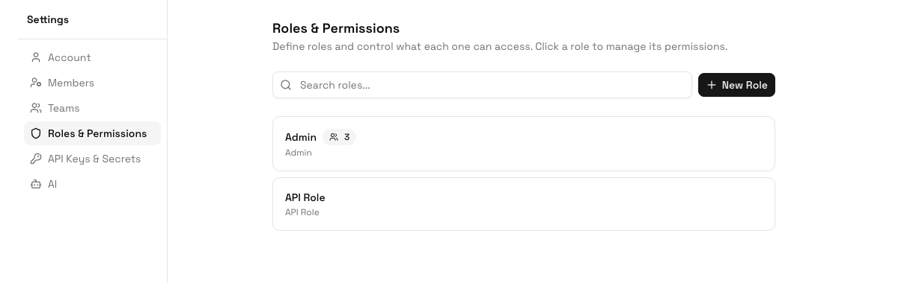

Use **Settings > Roles & Permissions** to define what each type of user can access. Roles are best for broad responsibility levels such as Admin, Manager, Operator, Finance, Vendor Coordinator, or Viewer.

Roles work together with table, view, column, and record permissions. A user must have the right role permission and the right table-level access to complete many actions.

## Create a Role

<Steps>
  <Step title="Open Roles & Permissions">
    Go to **Settings > Roles & Permissions**.
  </Step>
  <Step title="Click New Role">
    Enter a clear role name and description.
  </Step>
  <Step title="Save the role">
    The new role appears in the role list and can be assigned to users.
  </Step>
</Steps>

## Manage Role Permissions

1. Open **Settings > Roles & Permissions**.
2. Select the role you want to update.
3. Click **Permissions**.
4. Enable or disable the resource actions this role should have.
5. Save the permission changes.

<Warning>
Avoid giving operational users broad administrative permissions just to solve one table access issue. First check whether table permissions, view permissions, or column permissions are the right place to grant access.
</Warning>

## View Members

Open a role's members sheet to review who currently has that role. This is useful before changing permissions because one role update affects every user assigned to that role.

## Duplicate a Role

Duplicate a role when you need a similar permission set with a few differences. ERPLite creates a copy and attempts to copy the source role's permissions. Review the copied role before assigning it to users.

## Recommended Role Model

| Role Type | Typical Use |
|-----------|-------------|
| **Admin** | Workspace setup, users, roles, account settings, and sensitive configuration. |
| **Manager** | Team-level work queues, approvals, reports, and exception handling. |
| **Operator** | Day-to-day record updates, assigned tasks, and workflow actions. |
| **Viewer** | Read-only access for stakeholders who need visibility but should not change data. |
| **Integration/Application** | System access for automations or external tools, usually paired with API keys or secrets. |

## Best Practices

- Keep role names business-friendly.
- Use the fewest roles that match real responsibilities.
- Review members before expanding permissions.
- Use table and column permissions for data-specific restrictions.

## AI Guidance

### When to Use This Feature

An AI should use Role Management when a group of users shares the same authority level across the workspace.

### How to Use It

1. Translate responsibilities into role names.
2. Assign permissions at the role level only for broad capabilities.
3. Use table and column permissions for data-specific exceptions.
4. Review role members before changing permissions.

### How to Verify

The AI should verify permissions with at least one user assigned to the role and one user outside the role.
