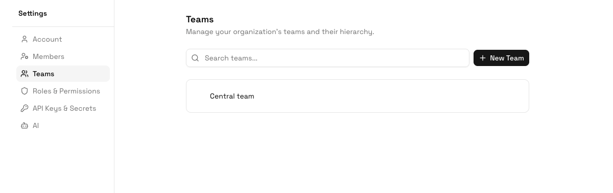

Use **Settings > Teams** to model the departments, sites, shifts, regions, vendors, or operating units that own work in ERPLite. Teams are used for assignments, filters, permissions, dashboards, and reports.

## How Team Hierarchy Works

Teams can be nested under a parent team. For example:

```text
Operations
  North Region
    Delhi Warehouse
    Jaipur Warehouse
  South Region
    Chennai Plant
    Bengaluru Hub
```

This hierarchy makes it easier to assign records, filter views, and grant access by operating unit.

## Create a Team

<Steps>
  <Step title="Open Teams">
    Go to **Settings > Teams**.
  </Step>
  <Step title="Click New Team">
    Create a new team under the root team, or use a parent team's action menu to add a child team.
  </Step>
  <Step title="Enter team details">
    Give the team a clear business name. Use names that users will recognize in filters, assignments, and reports.
  </Step>
  <Step title="Save">
    The team appears in the interactive hierarchy tree.
  </Step>
</Steps>

## Edit a Team

1. Search for the team if the hierarchy is large.
2. Open the team's action menu.
3. Choose **Edit**.
4. Update the name or parent details.
5. Save your changes.

## View Members

Open a team's members sheet to see which users belong to that team. Update memberships from the user profile when people move across teams.

## Delete a Team

Delete a team only after confirming it is no longer used for assignments, views, permissions, reports, or automations. If a team is referenced in active work, first move users and records to the replacement team.

## Best Practices

- Match the hierarchy to how managers review work.
- Keep team names stable because they appear in filters and exports.
- Use teams to scope work ownership; use roles to scope authority.
- Review team membership whenever a user changes role, location, or department.

## AI Guidance

### When to Use This Feature

An AI should use Teams when work ownership, queues, dashboards, permissions, reports, or assignments depend on departments, regions, sites, shifts, or operating units.

### How to Use It

1. Map the real organization hierarchy.
2. Create teams and child teams.
3. Assign users to the teams that own their work.
4. Use teams in views, permissions, dashboards, and automations.

### How to Verify

The AI should verify that team-based views and dashboards show the correct records for users in different teams.
