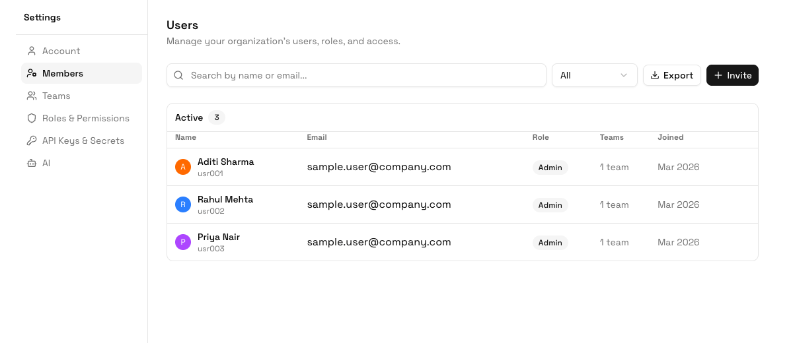

Use **Settings > Users** to invite people, maintain their profile details, assign roles and teams, reset passwords, and deactivate access. Users are grouped as **Active**, **Inactive**, or **Application** users so administrators can separate people from system or integration accounts.

## What User Access Controls

Each user can carry:

- **Name and email** used for identification, search, notifications, and login.
- **Phone number** used where phone-based login or operational contact is required.
- **Role** used for high-level permissions.
- **Teams** used for assignment, visibility, filters, and reporting.
- **External ID** used when the same person is referenced by another system.
- **Active status** used to keep or remove access without losing historical ownership.

## Invite a User

<Steps>
  <Step title="Open Users">
    Go to **Settings > Users**.
  </Step>
  <Step title="Click Invite">
    Click **Invite** in the top-right of the Users page.
  </Step>
  <Step title="Enter user details">
    Add the user's name, email, phone number if needed, role, teams, and password details requested by your workspace.
  </Step>
  <Step title="Create the user">
    Save the invite. The user appears in the Active users list once created.
  </Step>
</Steps>

## Edit a User

1. Open **Settings > Users**.
2. Search for the user by name or email.
3. Open the action menu for that user and choose **Edit**.
4. Update the user's profile, role, teams, phone number, external ID, or status.
5. Save the changes.

<Tip>
When a user moves teams, update both the team assignment and the role if their responsibilities changed. Team assignment changes what work they see; role changes what they can do.
</Tip>

## Password Resets

Administrators can reset a user's password from the user actions menu. Use this when a user cannot complete the normal login or recovery flow.

For workspaces with two-factor login enabled, users may still be asked for a verification code after entering the new password.

## Deactivate, Reactivate, or Delete a User

Use **Deactivate** when the person should no longer access ERPLite but their historical assignments, comments, approvals, or records should remain auditable. Deactivated users move to the **Inactive** group and can be reactivated later.

Use **Delete** only when your operating policy allows permanent removal. This is more disruptive because the user may still be referenced in old records.

## Search, Filter, and Export

The Users page supports:

- Search by name, email, or user ID.
- Filtering by Active, Inactive, or Application users.
- Exporting the current user list to CSV for audits or access reviews.

## Best Practices

- Use real email addresses for people who need notifications or workspace recovery.
- Give each user one primary role, then use teams and table permissions for operational scoping.
- Review inactive users regularly during access audits.
- Use application users for integrations, not for people.

## AI Guidance

### When to Use This Feature

An AI should use User Management when onboarding people, changing access, investigating missing visibility, or offboarding users.

### How to Use It

1. Confirm the person, email, phone number, role, and teams.
2. Invite or update the user.
3. Assign the minimum role and team access required.
4. Deactivate instead of deleting when historical audit context matters.

### How to Verify

The AI should verify that the user can sign in, see the expected tables/views, perform intended actions, and cannot access restricted data.
